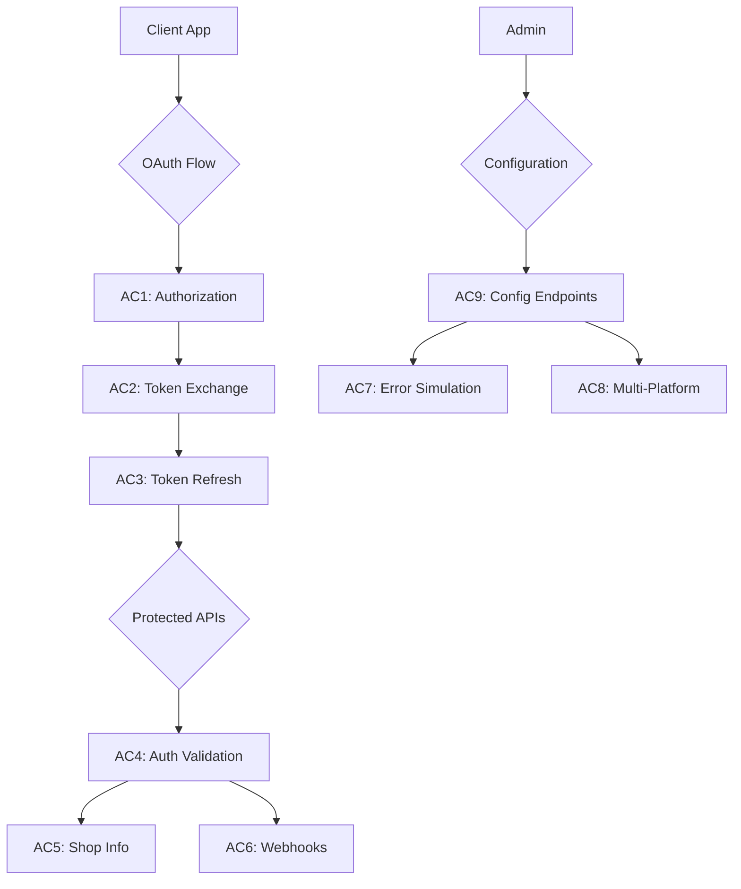

# Mock Marketplace Platform - Sequence Diagrams

Mermaid.js sequence diagrams for all acceptance criteria.

## Acceptance Criteria

| AC | Name | File |
|----|------|------|
| AC1 | OAuth Authorization Flow | [ac1-oauth-authorization-flow.md](./ac1-oauth-authorization-flow.md) |
| AC2 | Token Exchange | [ac2-token-exchange.md](./ac2-token-exchange.md) |
| AC3 | Token Refresh | [ac3-token-refresh.md](./ac3-token-refresh.md) |
| AC4 | Auth Validation | [ac4-auth-validation.md](./ac4-auth-validation.md) |
| AC5 | Shop Information | [ac5-shop-information.md](./ac5-shop-information.md) |
| AC6 | Webhook Simulation | [ac6-webhook-simulation.md](./ac6-webhook-simulation.md) |
| AC7 | Error Scenarios | [ac7-error-scenarios.md](./ac7-error-scenarios.md) |
| AC8 | Multi-Platform | [ac8-multi-platform.md](./ac8-multi-platform.md) |
| AC9 | Configuration | [ac9-configuration.md](./ac9-configuration.md) |

## Viewing Diagrams

These diagrams use [Mermaid.js](https://mermaid.js.org/) syntax. You can view them:

1. **GitHub** - Renders mermaid diagrams natively in markdown
2. **VS Code** - Install "Markdown Preview Mermaid Support" extension
3. **Mermaid Live Editor** - https://mermaid.live/
4. **CLI** - `npx @mermaid-js/mermaid-cli mmdc -i file.md -o file.svg`

## Flow Overview

