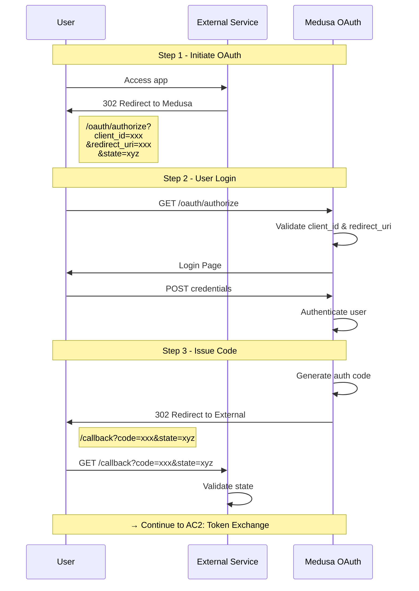

# AC1: OAuth Authorization Flow

External service needs Medusa data, redirects user to Medusa for authorization.

## Prerequisites
- External Service registered with Medusa (has client_id, client_secret)
- redirect_uri pre-registered
- External Service has Medusa OAuth URLs in env config

## Sequence Diagram

## Error Cases

| Step | Error | Response |
|------|-------|----------|
| Step 2 | Invalid client_id | 400 Invalid client |
| Step 2 | Invalid redirect_uri | 400 Invalid redirect_uri |
| Step 2 | Invalid credentials | Show login error |
| Step 3 | State mismatch | 400 Invalid state (CSRF protection) |
