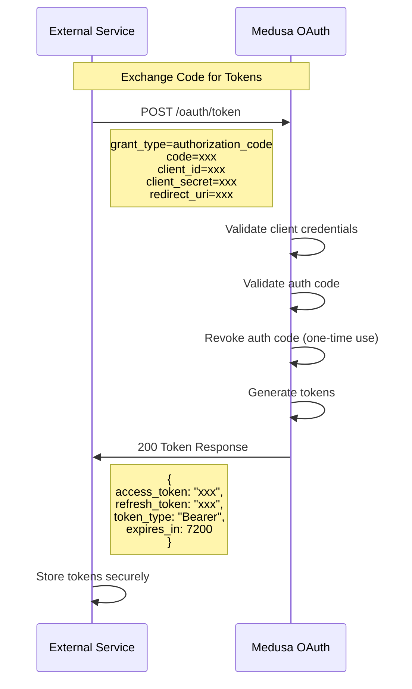

# AC2: Token Exchange

External service exchanges authorization code for access_token and refresh_token.

## Sequence Diagram

## Error Cases

| Error | Response |
|-------|----------|
| Invalid client_id/secret | 401 invalid_client |
| Code not found | 400 invalid_grant |
| Code expired | 400 invalid_grant |
| Code already used | 400 invalid_grant |
| redirect_uri mismatch | 400 invalid_grant |
