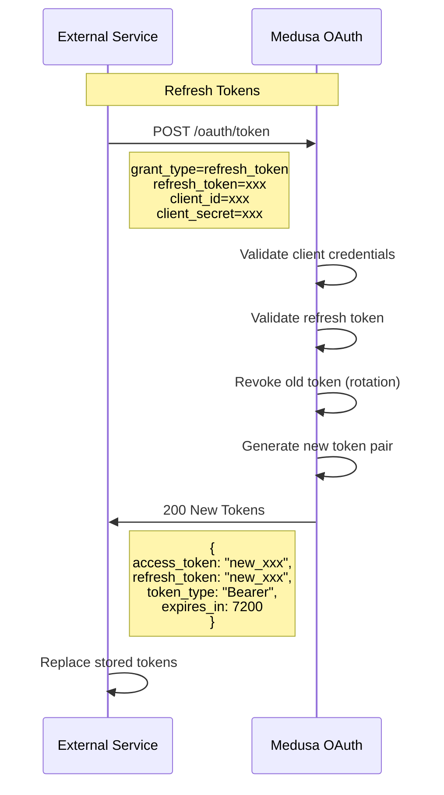
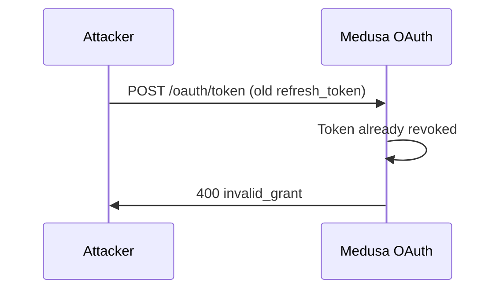

# AC3: Token Refresh

External service uses refresh_token to obtain new tokens. Implements rotating refresh tokens.

## Sequence Diagram

## Token Rotation

Old refresh_token is invalidated after use. If attacker tries to reuse:

## Error Cases

| Error | Response |
|-------|----------|
| Invalid client credentials | 401 invalid_client |
| Refresh token not found | 400 invalid_grant |
| Refresh token expired | 400 invalid_grant |
| Refresh token revoked | 400 invalid_grant |
