# AC4: Auth Validation

Medusa validates access tokens on protected API requests.

## Sequence Diagram

## Error Cases

```mermaid
sequenceDiagram
    participant External as External Service
    participant Medusa as Medusa API

    Note over External,Medusa: Missing Token

    External->>Medusa: GET /api/resource
    Note right of External: (no Authorization header)
    Medusa->>External: 401 Unauthorized

    Note over External,Medusa: Invalid Token

    External->>Medusa: GET /api/resource
    Note right of External: Authorization: Bearer invalid
    Medusa->>External: 401 invalid_token

    Note over External,Medusa: Expired Token

    External->>Medusa: GET /api/resource
    Note right of External: Authorization: Bearer expired
    Medusa->>External: 401 invalid_token
    Note right of External: → Use AC3 to refresh
```

## Error Summary

| Error | Status | Response |
|-------|--------|----------|
| Missing header | 401 | unauthorized |
| Invalid token | 401 | invalid_token |
| Expired token | 401 | invalid_token |
| Insufficient scope | 403 | insufficient_scope |
