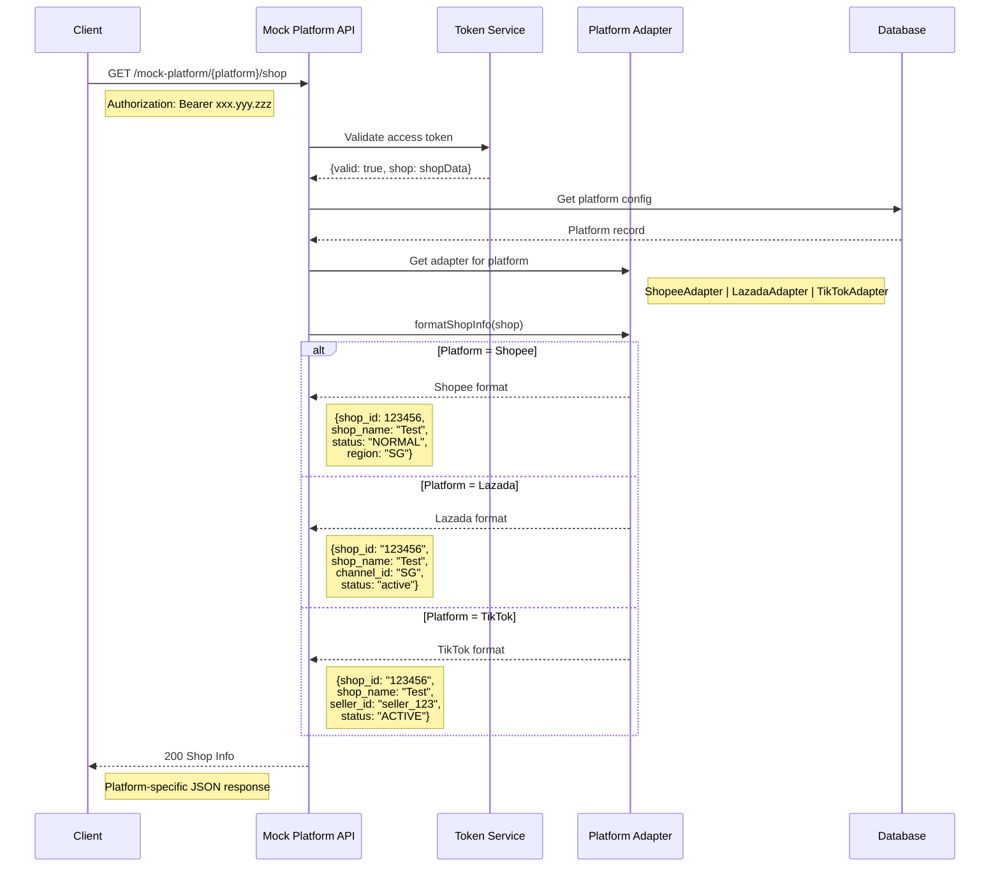

# AC5: Shop Information

Shop endpoint returns platform-specific fields (channel_id, seller_id).

```mermaid
sequenceDiagram
    participant Client
    participant MockPlatform as Mock Platform API
    participant TokenService as Token Service
    participant Adapter as Platform Adapter
    participant DB as Database

    Client->>MockPlatform: GET /mock-platform/{platform}/shop
    Note right of Client: Authorization: Bearer xxx.yyy.zzz

    MockPlatform->>TokenService: Validate access token
    TokenService-->>MockPlatform: {valid: true, shop: shopData}

    MockPlatform->>DB: Get platform config
    DB-->>MockPlatform: Platform record

    MockPlatform->>Adapter: Get adapter for platform
    Note right of Adapter: ShopeeAdapter | LazadaAdapter | TikTokAdapter

    MockPlatform->>Adapter: formatShopInfo(shop)

    alt Platform = Shopee
        Adapter-->>MockPlatform: Shopee format
        Note right of MockPlatform: {shop_id: 123456,<br/>shop_name: "Test",<br/>status: "NORMAL",<br/>region: "SG"}
    else Platform = Lazada
        Adapter-->>MockPlatform: Lazada format
        Note right of MockPlatform: {shop_id: "123456",<br/>shop_name: "Test",<br/>channel_id: "SG",<br/>status: "active"}
    else Platform = TikTok
        Adapter-->>MockPlatform: TikTok format
        Note right of MockPlatform: {shop_id: "123456",<br/>shop_name: "Test",<br/>seller_id: "seller_123",<br/>status: "ACTIVE"}
    end

    MockPlatform-->>Client: 200 Shop Info
    Note right of Client: Platform-specific JSON response
```
