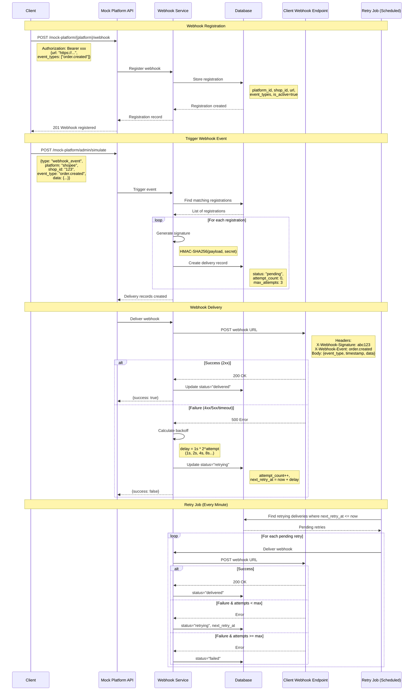

# AC6: Webhook Simulation

Registration, signature verification, delivery with exponential backoff retry.

```mermaid
sequenceDiagram
    participant Client
    participant MockPlatform as Mock Platform API
    participant WebhookService as Webhook Service
    participant DB as Database
    participant WebhookEndpoint as Client Webhook Endpoint
    participant RetryJob as Retry Job (Scheduled)

    Note over Client,RetryJob: Webhook Registration

    Client->>MockPlatform: POST /mock-platform/{platform}/webhook
    Note right of Client: Authorization: Bearer xxx<br/>{url: "https://...",<br/>event_types: ["order.created"]}

    MockPlatform->>WebhookService: Register webhook
    WebhookService->>DB: Store registration
    Note right of DB: platform_id, shop_id, url,<br/>event_types, is_active=true

    DB-->>WebhookService: Registration created
    WebhookService-->>MockPlatform: Registration record
    MockPlatform-->>Client: 201 Webhook registered

    Note over Client,RetryJob: Trigger Webhook Event

    Client->>MockPlatform: POST /mock-platform/admin/simulate
    Note right of Client: {type: "webhook_event",<br/>platform: "shopee",<br/>shop_id: "123",<br/>event_type: "order.created",<br/>data: {...}}

    MockPlatform->>WebhookService: Trigger event
    WebhookService->>DB: Find matching registrations
    DB-->>WebhookService: List of registrations

    loop For each registration
        WebhookService->>WebhookService: Generate signature
        Note right of WebhookService: HMAC-SHA256(payload, secret)

        WebhookService->>DB: Create delivery record
        Note right of DB: status: "pending",<br/>attempt_count: 0,<br/>max_attempts: 3
    end

    WebhookService-->>MockPlatform: Delivery records created

    Note over Client,RetryJob: Webhook Delivery

    MockPlatform->>WebhookService: Deliver webhook
    WebhookService->>WebhookEndpoint: POST webhook URL
    Note right of WebhookEndpoint: Headers:<br/>X-Webhook-Signature: abc123<br/>X-Webhook-Event: order.created<br/>Body: {event_type, timestamp, data}

    alt Success (2xx)
        WebhookEndpoint-->>WebhookService: 200 OK
        WebhookService->>DB: Update status="delivered"
        WebhookService-->>MockPlatform: {success: true}
    else Failure (4xx/5xx/timeout)
        WebhookEndpoint-->>WebhookService: 500 Error
        WebhookService->>WebhookService: Calculate backoff
        Note right of WebhookService: delay = 1s * 2^attempt<br/>(1s, 2s, 4s, 8s...)
        WebhookService->>DB: Update status="retrying"
        Note right of DB: attempt_count++,<br/>next_retry_at = now + delay
        WebhookService-->>MockPlatform: {success: false}
    end

    Note over Client,RetryJob: Retry Job (Every Minute)

    RetryJob->>DB: Find retrying deliveries where next_retry_at <= now
    DB-->>RetryJob: Pending retries

    loop For each pending retry
        RetryJob->>WebhookService: Deliver webhook
        WebhookService->>WebhookEndpoint: POST webhook URL

        alt Success
            WebhookEndpoint-->>WebhookService: 200 OK
            WebhookService->>DB: status="delivered"
        else Failure & attempts < max
            WebhookEndpoint-->>WebhookService: Error
            WebhookService->>DB: status="retrying", next_retry_at
        else Failure & attempts >= max
            WebhookEndpoint-->>WebhookService: Error
            WebhookService->>DB: status="failed"
        end
    end
```
