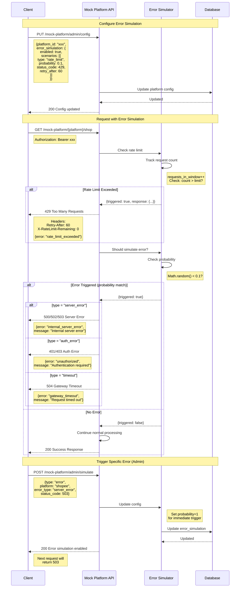

# AC7: Error Scenarios

Configurable rate limiting (429), auth errors (401/403), server errors (500/502/503), timeouts.

```mermaid
sequenceDiagram
    participant Client
    participant MockPlatform as Mock Platform API
    participant ErrorSimulator as Error Simulator
    participant DB as Database

    Note over Client,DB: Configure Error Simulation

    Client->>MockPlatform: PUT /mock-platform/admin/config
    Note right of Client: {platform_id: "xxx",<br/>error_simulation: {<br/>  enabled: true,<br/>  scenarios: [{<br/>    type: "rate_limit",<br/>    probability: 0.1,<br/>    status_code: 429,<br/>    retry_after: 60<br/>  }]<br/>}}

    MockPlatform->>DB: Update platform config
    DB-->>MockPlatform: Updated
    MockPlatform-->>Client: 200 Config updated

    Note over Client,DB: Request with Error Simulation

    Client->>MockPlatform: GET /mock-platform/{platform}/shop
    Note right of Client: Authorization: Bearer xxx

    MockPlatform->>ErrorSimulator: Check rate limit
    ErrorSimulator->>ErrorSimulator: Track request count
    Note right of ErrorSimulator: requests_in_window++<br/>Check: count > limit?

    alt Rate Limit Exceeded
        ErrorSimulator-->>MockPlatform: {triggered: true, response: {...}}
        MockPlatform-->>Client: 429 Too Many Requests
        Note right of Client: Headers:<br/>Retry-After: 60<br/>X-RateLimit-Remaining: 0<br/><br/>{error: "rate_limit_exceeded"}
    end

    MockPlatform->>ErrorSimulator: Should simulate error?
    ErrorSimulator->>ErrorSimulator: Check probability
    Note right of ErrorSimulator: Math.random() < 0.1?

    alt Error Triggered (probability match)
        ErrorSimulator-->>MockPlatform: {triggered: true}

        alt type = "server_error"
            MockPlatform-->>Client: 500/502/503 Server Error
            Note right of Client: {error: "internal_server_error",<br/>message: "Internal server error"}
        else type = "auth_error"
            MockPlatform-->>Client: 401/403 Auth Error
            Note right of Client: {error: "unauthorized",<br/>message: "Authentication required"}
        else type = "timeout"
            MockPlatform-->>Client: 504 Gateway Timeout
            Note right of Client: {error: "gateway_timeout",<br/>message: "Request timed out"}
        end
    else No Error
        ErrorSimulator-->>MockPlatform: {triggered: false}
        MockPlatform->>MockPlatform: Continue normal processing
        MockPlatform-->>Client: 200 Success Response
    end

    Note over Client,DB: Trigger Specific Error (Admin)

    Client->>MockPlatform: POST /mock-platform/admin/simulate
    Note right of Client: {type: "error",<br/>platform: "shopee",<br/>error_type: "server_error",<br/>status_code: 503}

    MockPlatform->>ErrorSimulator: Update config
    Note right of ErrorSimulator: Set probability=1<br/>for immediate trigger

    ErrorSimulator->>DB: Update error_simulation
    DB-->>ErrorSimulator: Updated

    MockPlatform-->>Client: 200 Error simulation enabled
    Note right of Client: Next request will<br/>return 503
```
