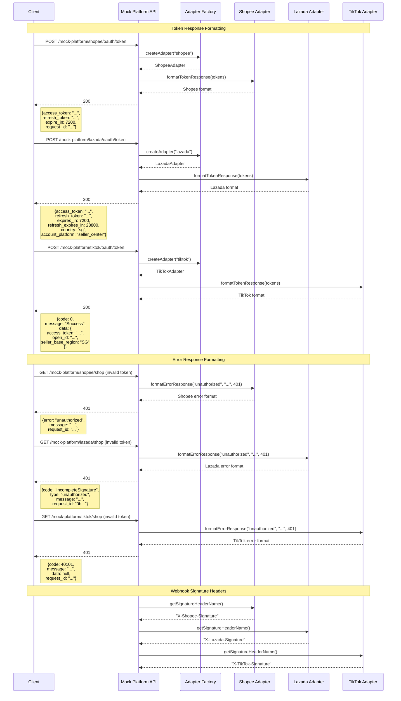

# AC8: Multi-Platform

Platform adapters for Shopee, Lazada, TikTok Shop with specific response formats.

```mermaid
sequenceDiagram
    participant Client
    participant MockPlatform as Mock Platform API
    participant AdapterFactory as Adapter Factory
    participant ShopeeAdapter as Shopee Adapter
    participant LazadaAdapter as Lazada Adapter
    participant TikTokAdapter as TikTok Adapter

    Note over Client,TikTokAdapter: Token Response Formatting

    Client->>MockPlatform: POST /mock-platform/shopee/oauth/token
    MockPlatform->>AdapterFactory: createAdapter("shopee")
    AdapterFactory-->>MockPlatform: ShopeeAdapter
    MockPlatform->>ShopeeAdapter: formatTokenResponse(tokens)
    ShopeeAdapter-->>MockPlatform: Shopee format
    MockPlatform-->>Client: 200
    Note right of Client: {access_token: "...",<br/>refresh_token: "...",<br/>expire_in: 7200,<br/>request_id: "..."}

    Client->>MockPlatform: POST /mock-platform/lazada/oauth/token
    MockPlatform->>AdapterFactory: createAdapter("lazada")
    AdapterFactory-->>MockPlatform: LazadaAdapter
    MockPlatform->>LazadaAdapter: formatTokenResponse(tokens)
    LazadaAdapter-->>MockPlatform: Lazada format
    MockPlatform-->>Client: 200
    Note right of Client: {access_token: "...",<br/>refresh_token: "...",<br/>expires_in: 7200,<br/>refresh_expires_in: 28800,<br/>country: "sg",<br/>account_platform: "seller_center"}

    Client->>MockPlatform: POST /mock-platform/tiktok/oauth/token
    MockPlatform->>AdapterFactory: createAdapter("tiktok")
    AdapterFactory-->>MockPlatform: TikTokAdapter
    MockPlatform->>TikTokAdapter: formatTokenResponse(tokens)
    TikTokAdapter-->>MockPlatform: TikTok format
    MockPlatform-->>Client: 200
    Note right of Client: {code: 0,<br/>message: "Success",<br/>data: {<br/>  access_token: "...",<br/>  open_id: "...",<br/>  seller_base_region: "SG"<br/>}}

    Note over Client,TikTokAdapter: Error Response Formatting

    Client->>MockPlatform: GET /mock-platform/shopee/shop (invalid token)
    MockPlatform->>ShopeeAdapter: formatErrorResponse("unauthorized", "...", 401)
    ShopeeAdapter-->>MockPlatform: Shopee error format
    MockPlatform-->>Client: 401
    Note right of Client: {error: "unauthorized",<br/>message: "...",<br/>request_id: "..."}

    Client->>MockPlatform: GET /mock-platform/lazada/shop (invalid token)
    MockPlatform->>LazadaAdapter: formatErrorResponse("unauthorized", "...", 401)
    LazadaAdapter-->>MockPlatform: Lazada error format
    MockPlatform-->>Client: 401
    Note right of Client: {code: "IncompleteSignature",<br/>type: "unauthorized",<br/>message: "...",<br/>request_id: "0b..."}

    Client->>MockPlatform: GET /mock-platform/tiktok/shop (invalid token)
    MockPlatform->>TikTokAdapter: formatErrorResponse("unauthorized", "...", 401)
    TikTokAdapter-->>MockPlatform: TikTok error format
    MockPlatform-->>Client: 401
    Note right of Client: {code: 40101,<br/>message: "...",<br/>data: null,<br/>request_id: "..."}

    Note over Client,TikTokAdapter: Webhook Signature Headers

    MockPlatform->>ShopeeAdapter: getSignatureHeaderName()
    ShopeeAdapter-->>MockPlatform: "X-Shopee-Signature"

    MockPlatform->>LazadaAdapter: getSignatureHeaderName()
    LazadaAdapter-->>MockPlatform: "X-Lazada-Signature"

    MockPlatform->>TikTokAdapter: getSignatureHeaderName()
    TikTokAdapter-->>MockPlatform: "X-TikTok-Signature"
```
