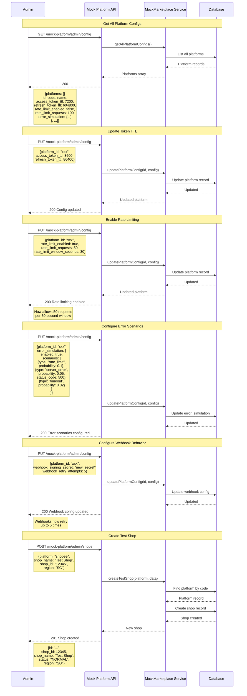

# AC9: Configuration

Admin endpoints to configure TTL, rate limits, error scenarios, webhook behavior.

```mermaid
sequenceDiagram
    participant Admin
    participant MockPlatform as Mock Platform API
    participant Service as MockMarketplace Service
    participant DB as Database

    Note over Admin,DB: Get All Platform Configs

    Admin->>MockPlatform: GET /mock-platform/admin/config
    MockPlatform->>Service: getAllPlatformConfigs()
    Service->>DB: List all platforms
    DB-->>Service: Platform records
    Service-->>MockPlatform: Platforms array
    MockPlatform-->>Admin: 200
    Note right of Admin: {platforms: [{<br/>  id, code, name,<br/>  access_token_ttl: 7200,<br/>  refresh_token_ttl: 604800,<br/>  rate_limit_enabled: false,<br/>  rate_limit_requests: 100,<br/>  error_simulation: {...}<br/>}, ...]}

    Note over Admin,DB: Update Token TTL

    Admin->>MockPlatform: PUT /mock-platform/admin/config
    Note right of Admin: {platform_id: "xxx",<br/>access_token_ttl: 3600,<br/>refresh_token_ttl: 86400}

    MockPlatform->>Service: updatePlatformConfig(id, config)
    Service->>DB: Update platform record
    DB-->>Service: Updated
    Service-->>MockPlatform: Updated platform
    MockPlatform-->>Admin: 200 Config updated

    Note over Admin,DB: Enable Rate Limiting

    Admin->>MockPlatform: PUT /mock-platform/admin/config
    Note right of Admin: {platform_id: "xxx",<br/>rate_limit_enabled: true,<br/>rate_limit_requests: 50,<br/>rate_limit_window_seconds: 30}

    MockPlatform->>Service: updatePlatformConfig(id, config)
    Service->>DB: Update platform record
    DB-->>Service: Updated
    Service-->>MockPlatform: Updated platform
    MockPlatform-->>Admin: 200 Rate limiting enabled
    Note right of Admin: Now allows 50 requests<br/>per 30 second window

    Note over Admin,DB: Configure Error Scenarios

    Admin->>MockPlatform: PUT /mock-platform/admin/config
    Note right of Admin: {platform_id: "xxx",<br/>error_simulation: {<br/>  enabled: true,<br/>  scenarios: [<br/>    {type: "rate_limit",<br/>     probability: 0.1},<br/>    {type: "server_error",<br/>     probability: 0.05,<br/>     status_code: 500},<br/>    {type: "timeout",<br/>     probability: 0.02}<br/>  ]<br/>}}

    MockPlatform->>Service: updatePlatformConfig(id, config)
    Service->>DB: Update error_simulation
    DB-->>Service: Updated
    MockPlatform-->>Admin: 200 Error scenarios configured

    Note over Admin,DB: Configure Webhook Behavior

    Admin->>MockPlatform: PUT /mock-platform/admin/config
    Note right of Admin: {platform_id: "xxx",<br/>webhook_signing_secret: "new_secret",<br/>webhook_retry_attempts: 5}

    MockPlatform->>Service: updatePlatformConfig(id, config)
    Service->>DB: Update webhook config
    DB-->>Service: Updated
    MockPlatform-->>Admin: 200 Webhook config updated
    Note right of Admin: Webhooks now retry<br/>up to 5 times

    Note over Admin,DB: Create Test Shop

    Admin->>MockPlatform: POST /mock-platform/admin/shops
    Note right of Admin: {platform: "shopee",<br/>shop_name: "Test Shop",<br/>shop_id: "12345",<br/>region: "SG"}

    MockPlatform->>Service: createTestShop(platform, data)
    Service->>DB: Find platform by code
    DB-->>Service: Platform record
    Service->>DB: Create shop record
    DB-->>Service: Shop created
    Service-->>MockPlatform: New shop
    MockPlatform-->>Admin: 201 Shop created
    Note right of Admin: {id: "...",<br/>shop_id: 12345,<br/>shop_name: "Test Shop",<br/>status: "NORMAL",<br/>region: "SG"}
```
